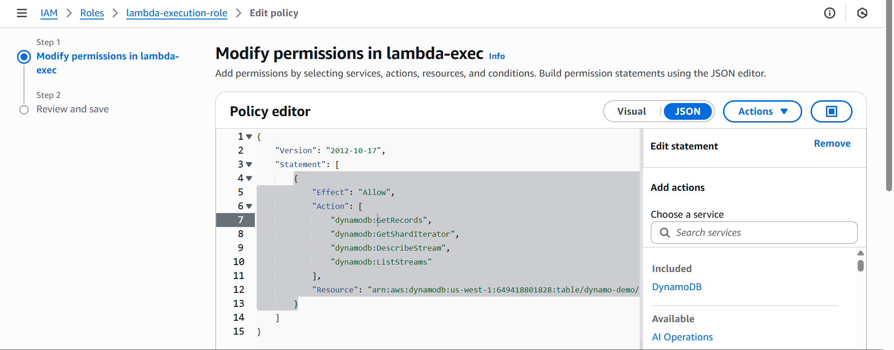

#  AWS Disaster Recovery for DynamoDB

This project implements a **disaster recovery mechanism** for a DynamoDB table using **AWS Backup, Lambda, and PITR (Point-in-Time Recovery)**.  
It ensures that deleted or modified data can be restored to the previous state within seconds of any unintended change.

---

## Purpose

- Monitoring real-time changes to the DynamoDB table using **DynamoDB Streams**.
- Automatically restoring deleted or modified items to the previous state.
- Maintaining high availability and resilience with **AWS Backup** and **Point-in-Time Recovery**.

---

##  Resources Used

- **DynamoDB Table** (Primary Region)
- **DynamoDB Streams** (NEW_AND_OLD_IMAGES)
- **AWS Backup Vault**
- **AWS Backup Plan** (Scheduled backups + PITR enabled)
- **Lambda Function**: Change Monitor (triggered on DynamoDB Stream events)

- **IAM Roles**:
  - Lambda execution role (permissions: dynamodb:DescribeStream, GetRecords, StartRestoreJob)
  - 
  - AWS Backup restore role (PassRole permissions)
  - 
- **CloudWatch Logs** (monitor Lambda execution and restore activity)

---

##  Plan of Action

1. **Creating DynamoDB table** in primary region and optionally add items.
2. **Enabling DynamoDB Streams** with `NEW_AND_OLD_IMAGES`.
3. **Creating a backup vault** in AWS Backup.
4. **Creating a backup plan**:
   - Scheduled backups every 12 hours
   - Retain backups for 35 days
   - Enable PITR
5. **Creating Lambda function** (Change Monitor) to monitor stream events:
   - Triggered on INSERT, MODIFY, REMOVE
   - Calls `StartRestoreJob` to restore table from latest recovery point before the change
6. **Attaching IAM roles** and necessary permissions to Lambda and AWS Backup.
7. **Testing** by adding, modifying, and deleting items in the DynamoDB table.
8. **Checking CloudWatch logs** and restored table to validate recovery process.

## Architecture

This diagram shows the flow of DynamoDB changes, Lambda triggers, and AWS Backup restore jobs:

## Roles

This diagram shows the flow of AWS Lambda and AWS Backup roles and policies assigned to them:

## Restored Database Jobs

